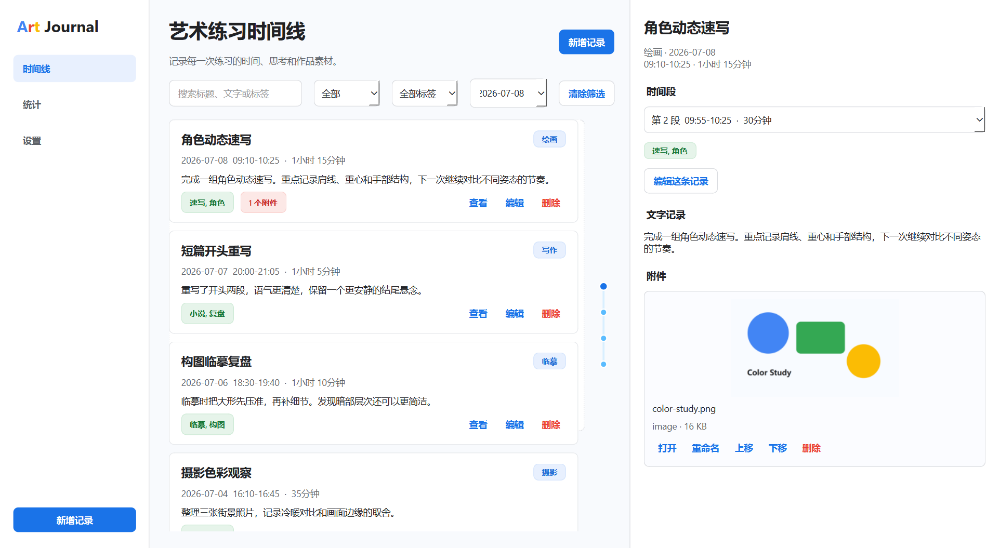
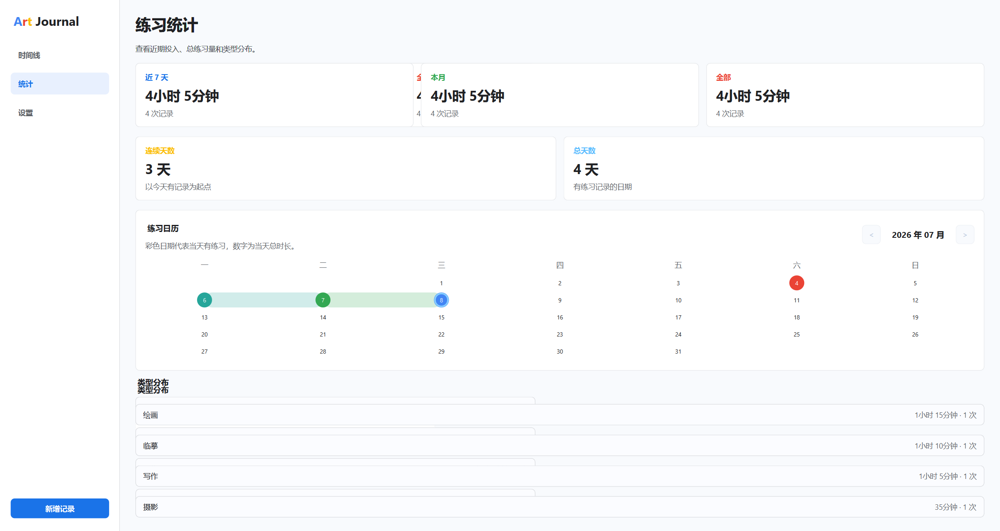
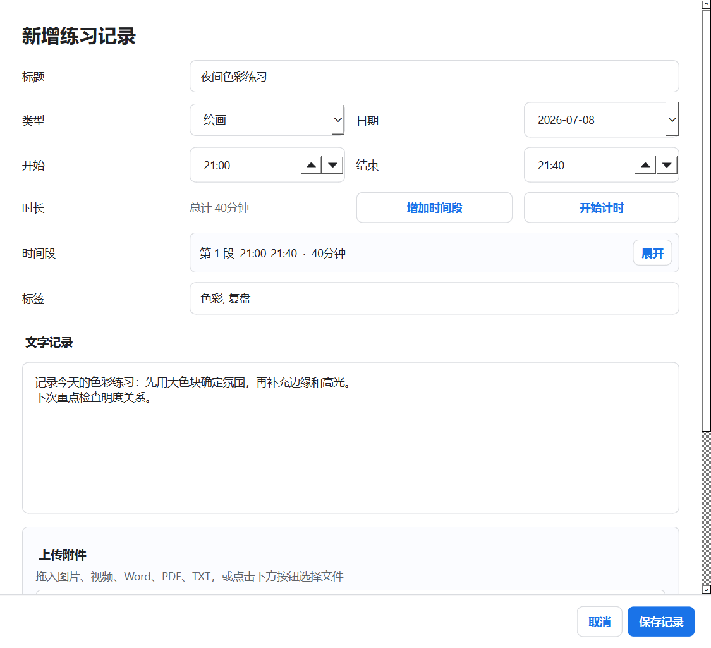

# 艺术练习记录器

一个面向个人创作者的本地艺术练习记录器。它把绘画、写作、临摹、摄影等练习整理成时间线：记录时间、分段计时、文字复盘、标签、附件资料和练习统计。界面采用白底、留白、浅边框和 Google 风格强调色，适合长期、安静地记录自己的创作训练。



## 核心特色

- **艺术练习时间线**：按日期展示练习记录，支持标题、类型、标签、文字摘要和附件数量。
- **分段计时**：开始、暂停、继续计时；也可以手动增加、编辑、删除多个时间段。
- **文字复盘**：支持多行记录，用于保存练习心得、问题、下次目标和创作备注。
- **附件资料库**：图片、视频、Word、PDF、TXT 等附件会复制到本地资料库，原文件删除后仍可访问。
- **详情预览**：右侧面板展示完整记录、时间段、图片预览、附件打开、重命名、删除和排序。
- **练习统计日历**：统计近 7 天、本月、全部、连续天数、总天数，并用彩色日历展示练习日和时长。
- **本地优先**：SQLite + 本地文件夹保存，不需要账号、云同步或联网。

## 界面展示

### 统计日历



### 新增与编辑记录



## 快速开始

需要 Python 3.11+。

```powershell
git clone <your-repo-url>
cd ArtPracticeJournal
python -m venv .venv
.\.venv\Scripts\Activate.ps1
python -m pip install -r requirements.txt
python main.py
```

如果希望双击启动且不显示终端窗口，可以运行：

```powershell
python main.pyw
```

## 打包 Windows EXE

项目提供了 PyInstaller 打包脚本：

```powershell
.\build_windows.ps1
```

构建完成后会生成：

```text
dist/ArtPracticeJournal.exe
```

`dist/` 不建议提交到 GitHub 仓库。发布给他人使用时，建议把 exe 上传到 GitHub Releases。

## 数据位置

源码运行时，应用会在项目根目录自动创建：

```text
data/
  art_journal.db
  attachments/
  thumbnails/
```

打包后运行时，数据默认保存在 exe 同级目录的 `data/` 文件夹。应用设置页可以修改数据库、附件和缩略图目录。
